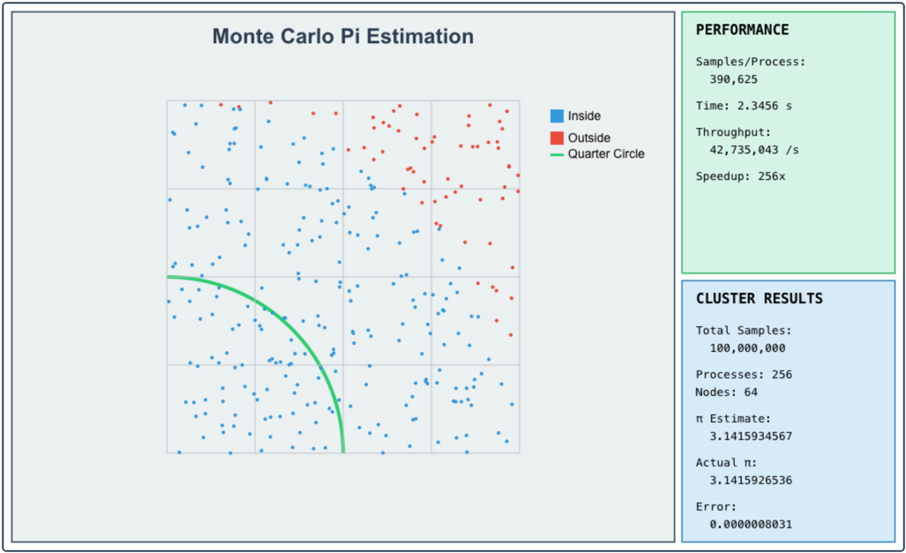

# Monte-Carlo-Pi-Estimation
Monte Carlo Pi Estimation - MVP Version Estimates Pi by randomly sampling points in a unit square

# Run the script:

Test with different sample sizes 

python3 monte_carlo_pi_mvp.py -n 100000

python3 monte_carlo_mvp.py -n 1000000000

# Run via MPI
mpirun -np 1 python3 monte_carlo_pi_mpi.py -n 1000000

# Install OpenMPI and Python bindings
sudo apt-get install openmpi-bin libopenmpi-dev python3-pip
pip3 install mpi4py

